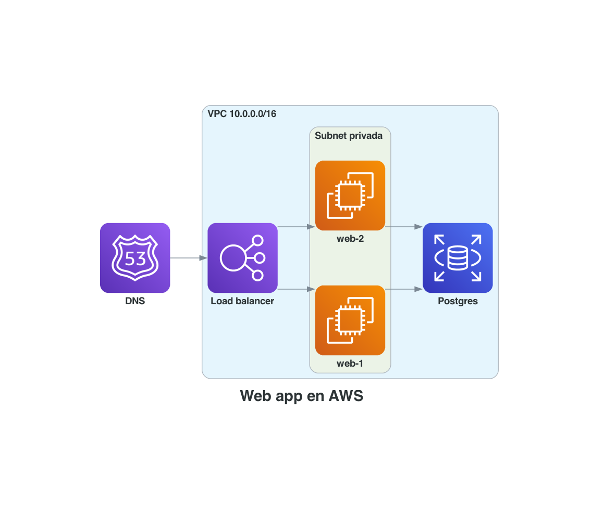

# diagrammer-mingrammer

Diagramas de arquitectura **como código**, generados en local con la librería Python
[`diagrams`](https://diagrams.mingrammer.com/) (mingrammer).

Escribís un script `.py` chico, lo corrés, y obtenés un PNG (o SVG) con los **iconos oficiales
de AWS / GCP / Azure / Kubernetes** que ya vienen incluidos en la librería. No hay backend, no
hay servicio web, no hay nada pago: todo el render pasa en tu máquina vía Graphviz.

Este repo es la contraparte de un proyecto equivalente hecho con Mermaid, para poder comparar
los dos approaches. Ver [Comparativa vs Mermaid](#comparativa-vs-mermaid) al final.



---

## Requisitos

| Qué | Versión | Nota |
|---|---|---|
| Python | 3.9 o superior | `python3 --version` |
| pip | cualquiera | viene con Python |
| **Graphviz** | 2.x o superior | **dependencia del sistema operativo**, no un paquete Python |

### Graphviz: por qué es aparte

`diagrams` no dibuja: arma un grafo y se lo pasa a **Graphviz**, que es un binario del sistema
(`dot`). `pip install diagrams` instala un *wrapper* de Python, pero **no** el binario. Si falta,
el render falla con un `ExecutableNotFound`.

```bash
# macOS
brew install graphviz

# Ubuntu / Debian
sudo apt update && sudo apt install graphviz

# Fedora / RHEL
sudo dnf install graphviz

# Windows (PowerShell como administrador)
choco install graphviz
# o bien:
winget install Graphviz.Graphviz
```

En Windows, si después de instalar `dot` no se encuentra, agregá a mano
`C:\Program Files\Graphviz\bin` al `PATH` y abrí una terminal nueva.

Verificá que quedó bien:

```bash
dot -V
# dot - graphviz version 16.0.0 (...)
```

---

## Instalación

```bash
git clone <este-repo> && cd diagrammer-mingrammer

make install          # crea .venv, instala requirements.txt y verifica los prerequisitos
```

O a mano, si preferís:

```bash
python3 -m venv .venv
source .venv/bin/activate          # Windows: .venv\Scripts\activate
pip install -r requirements.txt
```

Para chequear el entorno en cualquier momento:

```bash
make check
# OK  python    Python 3.14.6 -> .../.venv/bin/python
# OK  graphviz  dot - graphviz version 16.0.0
# OK  diagrams  0.25.1
```

---

## Estructura

```
diagrams_src/       scripts .py, uno por diagrama
  ejemplo_aws.py    el ejemplo: Route53 -> ELB -> 2x EC2 (en una VPC) -> RDS
  plantilla.py      esqueleto para copiar y empezar uno nuevo
output/             imágenes generadas (gitignored)
docs/               imágenes que se muestran en este README (esas sí versionadas)
render.sh           wrapper de render
Makefile            atajos: install / check / render / all / clean
requirements.txt    diagrams==0.25.1
```

---

## Cómo renderizar

Correr el `.py` **ya genera la imagen** — no hay un paso de CLI aparte:

```bash
python diagrams_src/ejemplo_aws.py     # -> output/ejemplo_aws.png
```

Los atajos hacen lo mismo pero se encargan del venv, del formato y de verificar Graphviz:

```bash
make render FILE=ejemplo_aws.py            # -> output/ejemplo_aws.png
make render FILE=ejemplo_aws.py FMT=svg    # -> output/ejemplo_aws.svg
make all                                   # renderiza todos los .py de diagrams_src/
make clean                                 # vacía output/

./render.sh ejemplo_aws                    # equivalente, sin make
FORMAT=svg ./render.sh ejemplo_aws
```

Formatos soportados por `outformat`: `png`, `svg`, `pdf`, `jpg`, `dot`.

---

## Cómo crear un diagrama nuevo

```bash
cp diagrams_src/plantilla.py diagrams_src/mi_diagrama.py
# editás el archivo
make render FILE=mi_diagrama.py
```

Anatomía de un script:

```python
import os
from pathlib import Path

from diagrams import Cluster, Diagram
from diagrams.aws.compute import EC2
from diagrams.aws.network import ELB

# 1) Dónde se guarda. Se resuelve desde este archivo para que el PNG caiga
#    siempre en /output, sin importar desde qué directorio lo ejecutes.
OUT = Path(__file__).resolve().parent.parent / "output" / "mi_diagrama"
FMT = os.getenv("FORMAT", "png")

# 2) El contexto principal: todo lo que se defina adentro entra al diagrama.
with Diagram("Mi título", filename=str(OUT), outformat=FMT, show=False, direction="LR"):
    lb = ELB("entrada")          # 3) los nodos son objetos Python

    with Cluster("VPC"):         # 4) Cluster = recuadro agrupador
        app = EC2("app")

    lb >> app                    # 5) el operador >> dibuja la flecha
```

Parámetros útiles de `Diagram`:

| Parámetro | Para qué |
|---|---|
| `filename` | ruta de salida **sin** extensión (la agrega según `outformat`) |
| `outformat` | `"png"` (default acá), `"svg"`, `"pdf"`, `"jpg"`, `"dot"` — también acepta una **lista** (`["png", "svg"]`) para renderizar varios formatos del mismo diagrama sin repetir el `with Diagram(...)` |
| `show=False` | no abrir el visor de imágenes al terminar (**siempre** en scripts versionados / CI, ver mejores prácticas) |
| `direction` | `LR` (izq→der), `TB` (arriba→abajo), `RL`, `BT` |
| `curvestyle` | `"ortho"` (default, líneas en ángulo recto) o `"curved"` |
| `strict` | `True` colapsa aristas duplicadas entre el mismo par de nodos (útil si un loop puede generar la misma conexión más de una vez) |
| `autolabel` | `True` antepone el nombre de la clase al label de cada nodo (ej. `EC2\nweb-1`) — útil en diagramas grandes o multi-proveedor donde el tipo de servicio no es obvio a simple vista |
| `graph_attr` / `node_attr` / `edge_attr` | dicts con atributos crudos de Graphviz que se aplican a todo el grafo / todos los nodos / todas las aristas (ej. `graph_attr={"fontsize": "20"}`) |

---

## Sintaxis básica

### 1. Nodos sueltos conectados

```python
from diagrams import Diagram
from diagrams.aws.compute import EC2
from diagrams.aws.database import RDS
from diagrams.aws.network import ELB

with Diagram("Simple", show=False):
    ELB("lb") >> EC2("web") >> RDS("db")
```

Variantes del operador:

| Operador | Resultado |
|---|---|
| `a >> b` | flecha de `a` a `b` |
| `a << b` | flecha de `b` a `a` |
| `a - b` | línea sin punta (relación bidireccional / sin dirección) |

### 2. Nodos agrupados en un Cluster (VPC / subnet)

Una lista de nodos a la derecha de `>>` hace **fan-out**; a la izquierda, **fan-in**:

```python
from diagrams import Cluster, Diagram
from diagrams.aws.compute import EC2
from diagrams.aws.database import RDS
from diagrams.aws.network import ELB

with Diagram("Con cluster", show=False, direction="LR"):
    lb = ELB("lb")

    with Cluster("VPC 10.0.0.0/16"):
        with Cluster("Subnet privada"):     # los Cluster se pueden anidar
            web = [EC2("web-1"), EC2("web-2")]
        db = RDS("postgres")

    lb >> web >> db      # lb -> web-1, lb -> web-2, y ambos -> db
```

### 3. Conexión entre grupos y flechas con estilo

Para conectar "grupo con grupo" se usa un nodo representante de cada lado (Graphviz no conecta
recuadros entre sí, conecta nodos). Con `Edge` se le pone label, color o estilo a la flecha:

```python
from diagrams import Cluster, Diagram, Edge
from diagrams.aws.compute import ECS
from diagrams.aws.database import Aurora
from diagrams.aws.integration import SQS

with Diagram("Entre grupos", show=False, direction="LR"):
    with Cluster("Servicios"):
        api = ECS("api")
        worker = ECS("worker")

    with Cluster("Datos"):
        cola = SQS("eventos")
        base = Aurora("aurora")

    api >> Edge(label="publica", color="darkgreen") >> cola
    cola >> Edge(label="consume", style="dashed") >> worker
    worker >> Edge(color="firebrick") >> base
```

Como es Python, podés usar loops, condicionales, listas y funciones para generar el diagrama
(por ejemplo, armar N réplicas desde una lista o leer un YAML de infraestructura).

---

## Iconos AWS incluidos

Todos vienen con la librería; no hace falta ningún pack de terceros. Los más relevantes para
diagramas de arquitectura:

| Módulo | Clases habituales |
|---|---|
| `diagrams.aws.compute` | `EC2`, `ECS`, `EKS`, `Lambda`, `Fargate`, `AutoScaling`, `ElasticBeanstalk` |
| `diagrams.aws.database` | `RDS`, `RDSInstance`, `Aurora`, `Dynamodb`, `ElastiCache`, `Redshift` |
| `diagrams.aws.network` | `VPC`, `ELB`, `ALB`, `NLB`, `Route53`, `CloudFront`, `APIGateway`, `NATGateway`, `InternetGateway`, `PrivateSubnet`, `PublicSubnet`, `VPCPeering`, `Endpoint` |
| `diagrams.aws.storage` | `S3`, `EFS`, `EBS`, `Backup`, `FSx` |
| `diagrams.aws.integration` | `SQS`, `SNS`, `Eventbridge`, `StepFunctions`, `Appsync` |
| `diagrams.aws.security` | `IAM`, `IAMRole`, `KMS`, `WAF`, `SecretsManager`, `Cognito`, `ACM`, `Guardduty` |
| `diagrams.aws.management` | `Cloudwatch`, `Cloudtrail`, `Config`, `SystemsManager`, `Organizations` |
| `diagrams.aws.analytics` | `Glue`, `Athena`, `Kinesis`, `KinesisDataStreams`, `EMR`, `Quicksight` |

Para ver todo lo que trae un módulo:

```bash
.venv/bin/python -c "import diagrams.aws.network as m; print([n for n in dir(m) if n[0].isupper()])"
```

Listado completo con las imágenes: <https://diagrams.mingrammer.com/docs/nodes/aws>.

## Otros proveedores disponibles

Todos se instalan con el mismo paquete `diagrams`, no hay packs adicionales que agregar:

| Paquete | Cubre |
|---|---|
| `diagrams.gcp.*` | Compute, networking, BigQuery/Dataflow, IA/ML, IoT — mismos módulos que AWS (`compute`, `network`, `database`, `analytics`, `security`…) |
| `diagrams.azure.*` | Compute, redes, DBs, DevOps, identidad — es el paquete con más submódulos (incluye `newicons` para íconos agregados en versiones recientes) |
| `diagrams.k8s.*` | Recursos nativos de Kubernetes: `compute` (Pod, Deployment, StatefulSet), `network` (Service, Ingress), `storage`, `rbac`, `controlplane`, `podconfig` (ConfigMap, Secret) |
| `diagrams.onprem.*` | Infra self-hosted / open source: `database` (Postgres, MySQL, Mongodb), `queue` (Kafka, RabbitMQ), `monitoring` (Grafana, Prometheus), `ci`/`cd` (Jenkins, ArgoCD), `network` (Nginx, Envoy), `vcs`, `iac` (Terraform, Ansible) |
| `diagrams.generic.*` | Formas neutrales sin marca (`compute`, `network`, `storage`, `os`, `device`) — para cuando el diagrama no debe atarse a un proveedor concreto |
| `diagrams.c4` | Elementos de notación **C4** (Person, Container, System, Relationship) para diagramas de arquitectura de software en vez de infraestructura |
| `diagrams.programming.*` | Lenguajes y frameworks (útil para diagramas de stack técnico, no solo infra) |
| `diagrams.saas.*` | Herramientas SaaS de terceros (Stripe, Twilio, Datadog, Slack…) |
| `diagrams.alibabacloud`, `.oci`, `.ibm`, `.digitalocean`, `.openstack`, `.outscale`, `.elastic`, `.firebase`, `.gis` | Proveedores/nichos adicionales, mismo patrón de import que AWS/GCP/Azure |

### Iconos personalizados con `Custom`

Cuando un servicio no tiene ícono en ningún paquete (una herramienta interna, un SaaS no
listado), se puede usar `diagrams.custom.Custom` con la ruta a un PNG local en vez de una clase
de proveedor:

```python
from diagrams.custom import Custom

mi_servicio = Custom("Servicio interno", "./assets/mi_logo.png")
```

Es el único caso en el que un nodo no viene de un módulo `diagrams.<provider>.*`; usarlo como
último recurso, no como reemplazo de buscar primero el ícono oficial correcto.

---

## Mejores prácticas

**Un diagrama por archivo, nombre de archivo = nombre del diagrama.** Así `make all` y
`render.sh` producen una salida predecible en `output/`, y el diff de un cambio de arquitectura
queda acotado a un solo `.py`.

**Nombrá las variables por el rol en la arquitectura, no por el tipo de nodo.** `web`, `db`,
`cola_eventos` se leen como el diagrama; `ec2_1`, `n2` no. El código es la documentación, así
que tiene que poder leerse como una descripción de la infra.

**`Cluster` es para límites reales, no para acomodar visualmente.** Usalo cuando el agrupamiento
representa algo que existe en la infra (una VPC, una subnet, un namespace de k8s, un dominio de
negocio). Anidarlos porque "quedan prolijos" sin que exista ese límite real hace que el diagrama
mienta sobre la arquitectura.

**Etiquetá una `Edge` solo cuando la flecha no se explica sola.** Un label, color o `style`
("publica", `style="dashed"` para async, `color="firebrick"` para una ruta crítica) aporta
cuando describe protocolo, sincronía o criticidad. Ponerle `Edge(...)` a cada conexión sin razón
es ruido visual.

**Elegí `direction` según el tipo de arquitectura**, no por default: `LR` para flujos de
request/pipeline (entra por un lado, sale por el otro), `TB` para arquitecturas en capas
(presentación / aplicación / datos apiladas verticalmente).

**Preferí el ícono oficial del proveedor correcto antes que `generic.*` o `Custom`.** Un `EC2`
mal elegido en vez de `ECS`/`Lambda` transmite una arquitectura distinta a la real. Reservá
`generic.*` para cuando el diagrama es intencionalmente agnóstico de proveedor, y `Custom` solo
cuando no existe ningún ícono aplicable.

**Resolvé el `filename` de salida en base a `__file__`, no a un path relativo fijo** (como ya
hacen `ejemplo_aws.py` y `plantilla.py`). Así el script produce el mismo resultado sin importar
desde qué directorio se lo ejecute.

**`show=False` siempre en scripts versionados.** Corren en CI o en la máquina de otra persona,
que puede no tener un visor de imágenes configurado; `show=True` (el default de la librería) es
solo para uso interactivo puntual.

**Si necesitás dos formatos del mismo diagrama, usá `outformat=["png", "svg"]`** en vez de dos
bloques `with Diagram(...)` — evita duplicar la definición de nodos y aristas.

**Como es Python, generá diagramas grandes con datos, no a mano.** Un loop corto sobre una lista
o un `dict` de infraestructura (por ejemplo, leído de un YAML) es preferible a copiar y pegar
`EC2("web-N")` diez veces; si el loop puede generar la misma conexión más de una vez, pasá
`strict=True` a `Diagram` para que Graphviz la colapse en una sola arista.

---

## Comparativa vs Mermaid

| | `diagrams` (este repo) | Mermaid |
|---|---|---|
| Iconos oficiales de cloud | **Sí**, AWS/GCP/Azure/K8s incluidos | No; hay que usar cajas de texto o packs externos |
| Dependencias | Python + **Graphviz** (binario del SO) | Ninguna si se renderiza en el navegador; `mermaid-cli` + Node/Chromium para PNG local |
| Cómo se escribe | Python: variables, loops, funciones | DSL declarativo de texto plano |
| Curva de aprendizaje | Más alta (es programar) | Muy baja |
| Layout | Automático por Graphviz; control fino vía `graph_attr` | Automático; menos ajustable |
| Preview en el editor | No: hay que renderizar el `.py` | Sí, nativo en GitHub, Notion, VS Code, Obsidian |
| Diff en el repo | Diffea el `.py`, la imagen es binaria (gitignored) | El diagrama vive en el `.md`, diffea perfecto |
| Fuerte en | Diagramas de arquitectura cloud que se tienen que *ver* como la infra real | Flowcharts, secuencias, ER, y todo lo que se lee inline en la doc |

**Regla práctica:** si el diagrama tiene que mostrar servicios cloud reconocibles y va a una
presentación o a un documento de arquitectura, `diagrams` gana. Si es un flujo lógico que vive
adentro de un README y querés que se vea sin generar nada, Mermaid gana.

---

## Licencia y costo

`diagrams` es MIT y Graphviz es EPL: todo local, gratis, sin cuentas ni límites de uso.

---

## Skill de Claude Code (en evaluación)

Se está evaluando documentar una Skill de Claude Code que escriba los `.py` de
`diagrams_src/` a partir de un pedido del usuario. El análisis de qué formato de input conviene
(prompt en lenguaje natural vs. una sintaxis tipo Eraser vs. Mermaid) y el alcance propuesto para
esa skill están en [`docs/claude-code-skill-scope.md`](docs/claude-code-skill-scope.md). La skill
todavía no existe; ese documento es solo la investigación previa.
